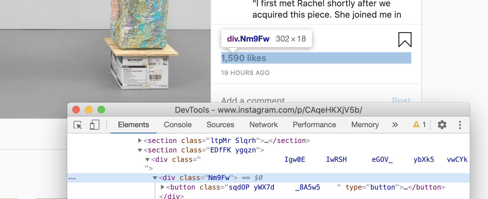

# Installation

In order to use Selenium we need to do two things first:
1. pip install selenium
2. download Google Chrome driver from: https://chromedriver.chromium.org/downloads

# Importing Libraries


```python
from selenium import webdriver
from selenium.webdriver.common.keys import Keys
from selenium.webdriver.chrome.options import Options
import time
import pandas as pd
import re
import pickle
import matplotlib.pyplot as plt
import seaborn as sns
import numpy as np

from scipy import stats # significance levels, normality
import statsmodels.api as sm # anova
from statsmodels.formula.api import ols

from sklearn.model_selection import train_test_split
from sklearn.model_selection import cross_val_score
from sklearn.linear_model import LinearRegression
from sklearn.preprocessing import MinMaxScaler
```

## Load Driver without Images


```python
#option = webdriver.ChromeOptions()
#chrome_prefs = {}
#chrome_prefs["profile.default_content_settings"] = {"images": 2}
#chrome_prefs["profile.managed_default_content_settings"] = {"images": 2}
#option.experimental_options["prefs"] = chrome_prefs
#driver = webdriver.Chrome('../chromedriver', options=option)
```

## Google Chrome


```python
driver = webdriver.Chrome('../chromedriver')
driver.get('https://www.instagram.com/accounts/login/')
```

## Simulating Click




```python
try:
    driver.execute_script('''document.getElementsByClassName('Nm9Fw')[0].lastElementChild.click()''')
except:
    return 'video'
```


```python

```
